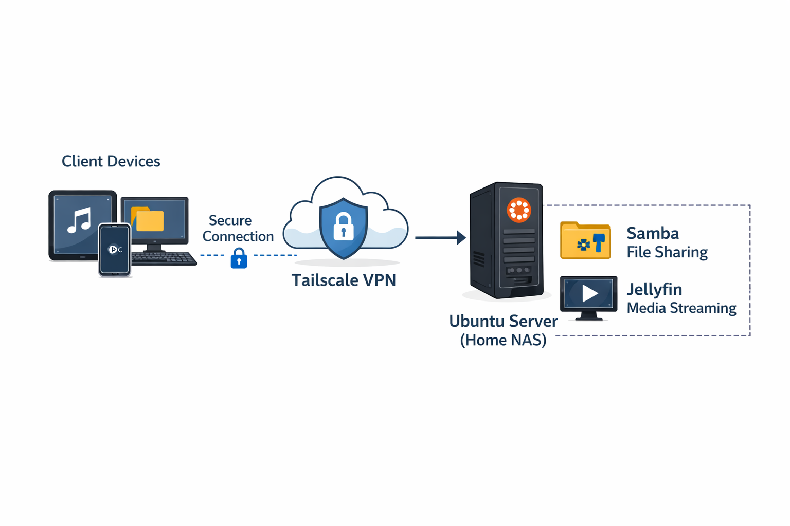

# 🧠 Home NAS + Media Streaming Server

## 📌 Overview

This project is a self-hosted NAS (Network Attached Storage) combined with a media streaming server.

The system allows users to:

* Store files centrally
* Back up files
* Access data remotely via VPN
* Stream music smoothly using a dedicated media server

---

## 🚀 Features

* 📂 File storage via Samba (SMB)
* 🎵 Music streaming via Jellyfin
* 🌐 Secure remote access via Tailscale VPN
* 👥 Multi-user support with access control
* 🔐 Firewall protection using UFW

---

## 🏗️ Architecture

```
Client (iPad / PC / Phone)
        ↓
   Tailscale VPN
        ↓
   Ubuntu Server (NAS)
   ├── Samba (File Sharing)
   └── Jellyfin (Streaming)
```

---

## ⚙️ Tech Stack

* OS: Ubuntu (Lubuntu)
* File Sharing: Samba (SMB)
* Media Server: Jellyfin
* VPN: Tailscale
* Firewall: UFW

---

## 🛠️ Setup Guide

### 1. Install Samba

```
sudo apt install samba
```

---

### 2. Create Users

```
(Adding another user for your system)
sudo adduser friend1
sudo smbpasswd -a friend1
```

---

### 3. Setup Folder Structure

```
mkdir -p /home/username/share/public
mkdir -p /home/username/share/yourname
mkdir -p /home/username/share/friend1
```

---

### 4. Setup Permissions (Important)

Set ownership:

```
sudo chown -R username:username /home/username/share
```

Set permissions:

```
sudo chmod -R 775 /home/username/share
```

Add users to group:

```
sudo usermod -aG username freind1
sudo usermod -aG username jellyfin
```

> ⚠️ Samba access depends on underlying Linux file permissions.

---

### 5. Configure Samba

Main config file:

```
/etc/samba/smb.conf
```

Example configuration:

```ini
[public]
   path = /home/wick/share/public
   browseable = yes
   read only = no
   valid users = wick safeena
   create mask = 0660
   directory mask = 0770

[wick]
   path = /home/wick/share/wick
   browseable = no
   valid users = wick
   read only = no
   create mask = 0660
   directory mask = 0770

[safeena]
   path = /home/wick/share/safeena
   browseable = no
   valid users = safeena wick(optional: when you want to be super user for manage your server)
   read only = no
   create mask = 0660
   directory mask = 0770
```

Test config:

```
testparm
```

Restart service:

```
sudo systemctl restart smbd
```

---

### 6. Install Jellyfin

```
sudo apt install jellyfin
```

Access web UI:

```
http://<server-ip>:8096
```

---

### 7. Setup VPN (Tailscale)

```
curl -fsSL https://tailscale.com/install.sh | sh
sudo tailscale up
```

---

### 8. Configure Firewall

```
sudo ufw allow 22
(samba)
sudo ufw allow from 192.168.1.0/24 to any port 445  (LAN)
sudo ufw allow from 100.64.0.0/10 to any port 445   (VPN)
(jellyfin)
sudo ufw allow from 192.168.1.0/24 to any port 8096 (LAN)
sudo ufw allow from 100.64.0.0/10 to any port 8096  (VPN)
```

---

## 📱 Usage

### Upload Files

* Access via SMB:

```
smb://<server-ip>
```
* Use apps like:

  * Files (iOS)
  * VLC
  * Windows Explorer

* Access in PC (linux)
  * Mount NAS Command NOTE:(YOU HAVE TO MOUNT EVERY TIME BEFORE UPLOADING FILE IN PC.)
  ``` 
  sudo mount -t cifs //<your IP address>/share /mnt/nas -o username=wick
  ```
  * Backup Command
  ```
  rsync -av /home/username/your target directory/ /mnt/nas/backup/
  ```
---

### Stream Music

* Use Jellyfin app
* Server:

```
http://<tailscale-ip>:8096
```

---

## 👥 User System

| User    | Role        |
| ------- | ----------- |
| wick    | Admin       |
| safeena | Normal user |

---

## 🔐 Permission Model

* Linux permissions control actual file access
* Samba only exposes shares
* Group-based access control is used

Example:

* wick → full access
* safeena → limited access

---

## 🧪 Troubleshooting

### ❌ Jellyfin cannot see files

Cause: Permission issue

Fix:

```
sudo usermod -aG wick jellyfin
sudo chmod -R 775 /home/wick/share
```

---

### ❌ SMB Permission denied

Fix:

```
sudo chown -R wick:wick /home/wick/share
```

---

### ❌ Slow streaming / buffering

Cause:

* Playing files directly via SMB

Fix:

* Use Jellyfin for streaming instead

---

## 📈 Future Improvements

* Add Fail2Ban for brute-force protection
* Setup automatic backup (rsync + cron)
* Add Nextcloud for web file access
* Use reverse proxy (NGINX)

---

## 💡 Key Learnings

* Linux permissions (user/group)
* Network file sharing (SMB)
* VPN networking
* Media streaming architecture
* System design & security fundamentals

---

## 🎯 Conclusion

This project demonstrates a real-world home server setup combining:

* Networking
* Security
* System administration

It provides a strong foundation for DevOps and security-related roles.

---

## 📸 Screenshots

(Add images here)

* Jellyfin UI
  
  
* Samba folders
```
/home/wick/share/
    |
    |-> public/
    |
    |-> safeena/
           |
           |
           |-> music/
    |
    |-> wick/
         |
         |-> backup/
         |
         |-> music/
               |
               |-> linkinpark/
               |       |
               |       |-> hybrid/
               |       |
               |       |-> meteora/
               |
               |-> kanyewest/
               |
               |
               |-> otherpopularmusic/
               |
               |
               |-> phonk/
               |
               |
               |-> sade/
```
* Network diagram
  
